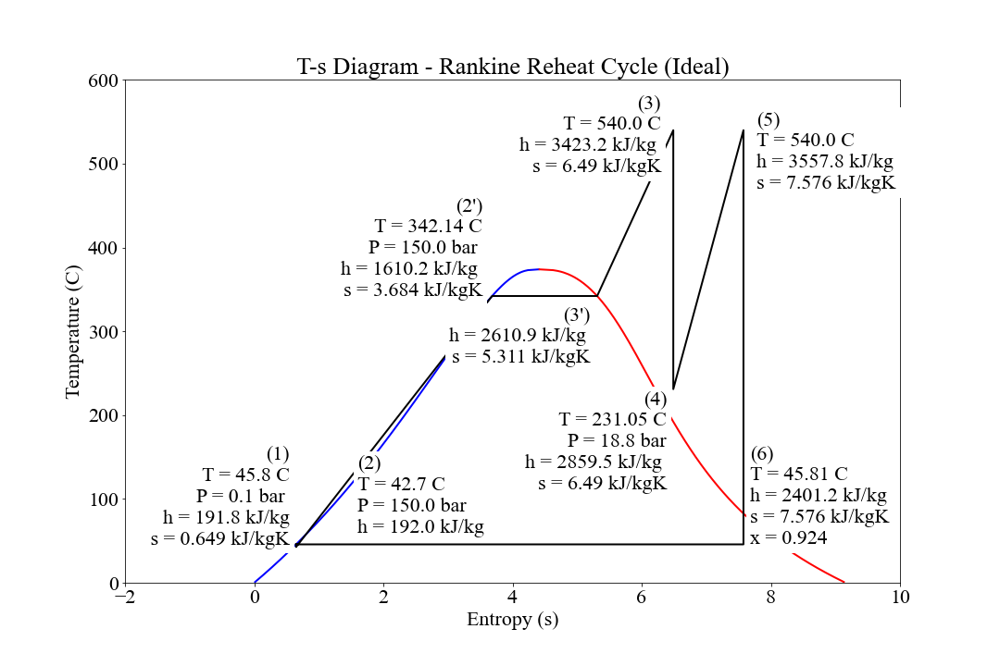

# steam-cycles-Ideal
Display T-s (Temperature-Entropy) diagrams for various ideal steam cycles (carnot, rankine, rankine superheat and rankine reheat). 

Code will calculate properties and overall efficiency then display to plot.

Please feel free to use/modify to your hearts content. The code is not the prettiest or the best and I in no way claim to be a programmer (It's just a hobby). If you think you can improve it, please go ahead.
